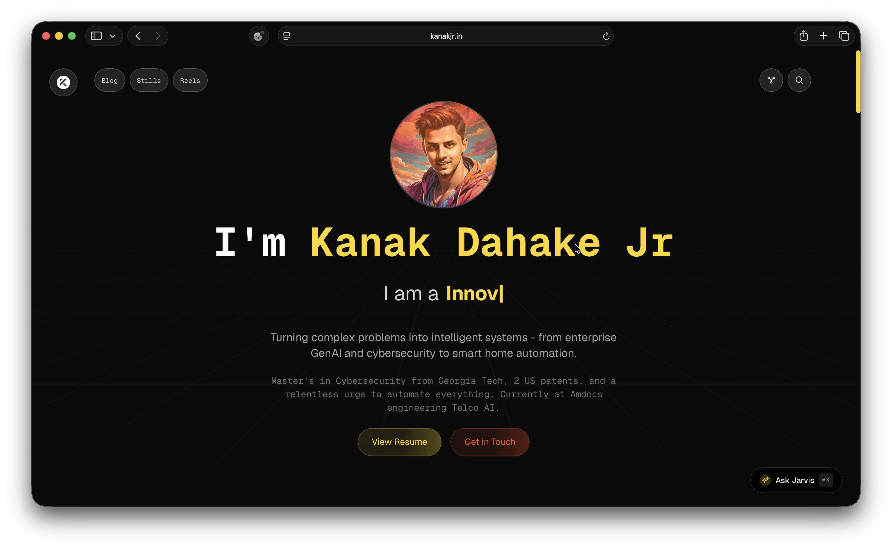
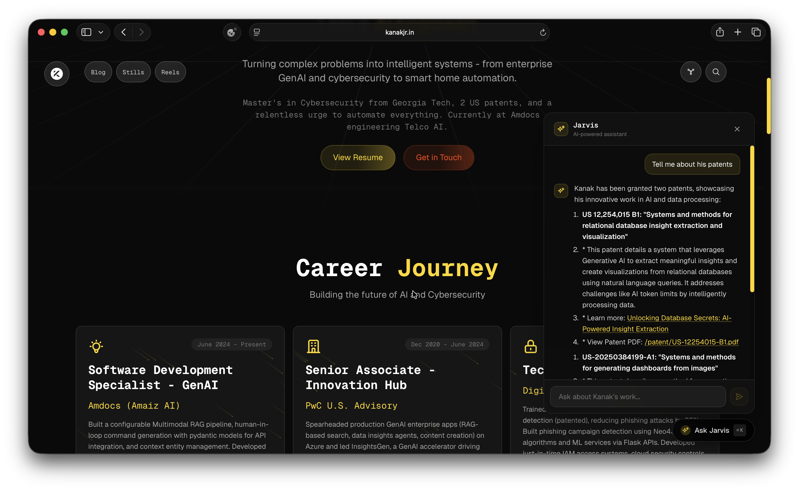
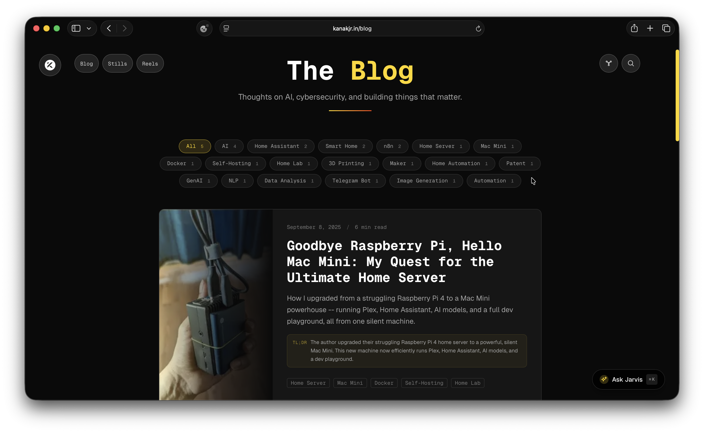
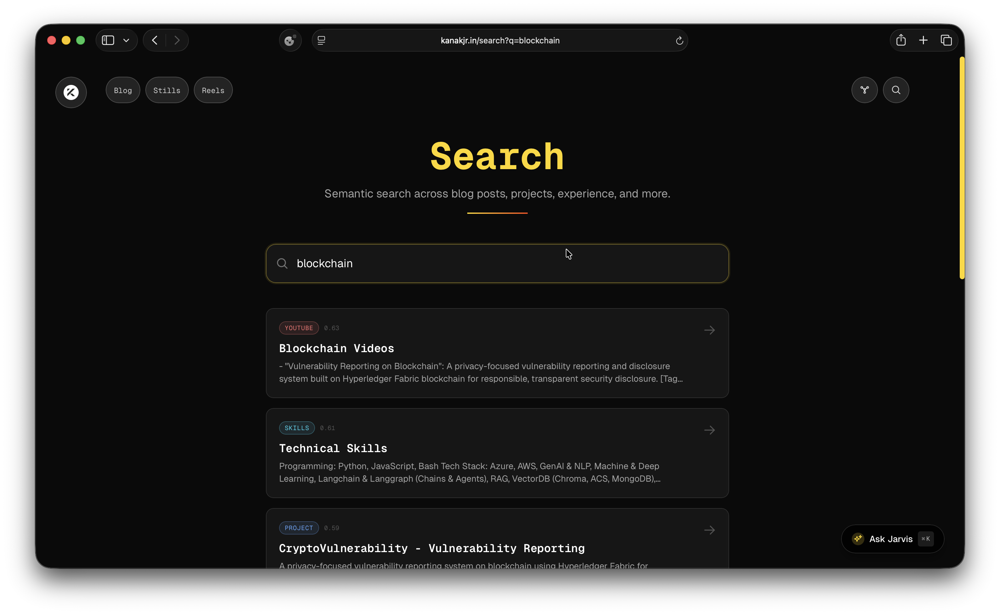
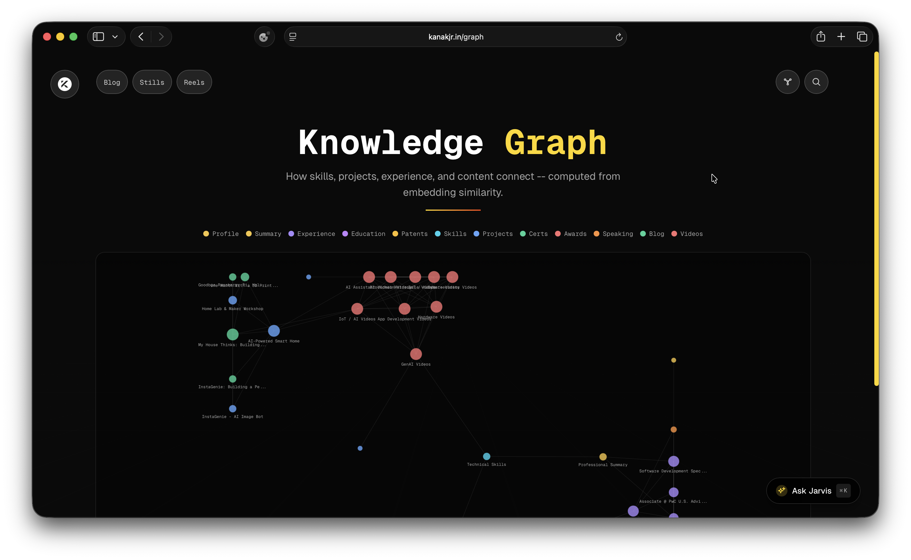

# kanakjr.in -- Portfolio Website v2

A high-performance, neo-retro portfolio website built with Next.js 15, featuring cyberpunk aesthetics, an AI-powered assistant (Jarvis), semantic search, a knowledge graph, an MDX blog, and cutting-edge animations throughout.

**Live:** [kanakjr.in](https://kanakjr.in)

---

## Screenshots

| Home |
|------|
|  |

| Jarvis AI Chat | Blog |
|----------------|------|
|  |  |

| Semantic Search | Knowledge Graph |
|-----------------|-----------------|
|  |  |

---

## Features

### Pages & Routes

- **Home** -- Hero section with animated avatar, typing animation, career timeline, patents, skills cloud, project cards, achievements, portfolio gallery, and social dock footer.
- **Blog** (`/blog`) -- MDX-powered blog with tag filtering.
- **Blog Post** (`/blog/[slug]`) -- Full MDX rendering with syntax highlighting and responsive images.
- **Semantic Search** (`/search`) -- Real-time semantic search across all content (blog, projects, experience, skills, videos, patents) powered by precomputed embeddings.
- **Knowledge Graph** (`/graph`) -- Interactive SVG graph showing how skills, projects, experience, and content connect via embedding similarity. Nodes are clickable and color-coded by category.
- **Stills / Frames** (`/stills`, `/frames`) -- Photo gallery with categories (Yamaha XSR, 3D Prints, Sketches) and a lightbox viewer.
- **Reels** (`/reels`) -- YouTube video gallery with category filtering, featured video support, and auto-play via `?v=<id>` query param.
- **Resume** (`/resume`) -- Full resume page with print/PDF support (print-friendly styles).
- **404** -- Custom not-found page with AI-powered suggestions pulled from semantic search based on the attempted URL.

### Jarvis -- AI Assistant

A floating AI chat assistant available on every page, toggled via `Cmd/Ctrl+K` or the "Ask Jarvis" button.

- **RAG-powered** -- Retrieves the top 5 relevant context chunks per query from precomputed knowledge embeddings.
- **Page-aware** -- Automatically boosts context relevant to the current page (e.g., blog post content when on `/blog/[slug]`, video data on `/reels`).
- **Streaming responses** -- Uses LangChain + Vercel AI SDK for real-time character-by-character streaming.
- **Conversation memory** -- Summarizes long conversations (8+ messages) to maintain context within model limits.
- **Suggested questions** -- Shows contextual example prompts to get started.

### Content & Data Pipeline

- **MDX Blog** -- Posts authored in `blog/content/*.mdx` with gray-matter frontmatter. Content stripped from client payloads for performance.
- **Knowledge Embeddings** -- All portfolio data (experience, projects, patents, skills, blog posts, videos) chunked and embedded via `npm run embeddings`. Stored in `data/knowledge-embeddings.json`.
- **Content Graph** -- Nodes and edges computed from embedding similarity (threshold >= 0.70), laid out using Fruchterman-Reingold. Stored in `data/content-graph.json`.
- **Gallery Thumbnails** -- WebP thumbnails auto-generated from full-size images via Sharp (`npm run thumbs`).

### UI & Design

- **Neo-Retro / Cyberpunk** -- Dark mode default with animated retro grid background, neon yellow/red accents, and monospace typography.
- **Magic UI Components** -- Retro grid, border beam, shimmer buttons, bento grid, magic cards, meteors, particles, dock, icon cloud, blur-fade, hero video dialog, typing animation, word rotate.
- **Framer Motion Animations** -- Scroll-triggered fade-ins, hover effects, smooth transitions throughout.
- **Responsive** -- Fully responsive across mobile, tablet, and desktop.
- **Quick Navigation** -- Fixed top nav with Blog, Stills, Reels links, plus Graph and Search icons. Mobile hamburger menu.
- **SEO** -- Dynamic sitemap (`/sitemap.xml`), `robots.txt`, and metadata on all pages.

---

## Tech Stack

| Layer | Technology |
|-------|------------|
| Framework | Next.js 15 (App Router) |
| React | 19 |
| Language | TypeScript |
| Styling | Tailwind CSS, next-themes |
| Animations | Framer Motion |
| UI Library | Magic UI + custom components |
| AI Model | Google Gemini (gemini-2.5-flash) |
| AI Framework | LangChain, Vercel AI SDK |
| Images | Next.js Image, Sharp |
| Containerization | Docker (multi-stage build) |

---

## Getting Started

### Prerequisites

- Node.js 18+
- A Google API key for Gemini (for AI features)

### Environment Variables

Create a `.env.local` file:

```env
GOOGLE_API_KEY=your_google_api_key
GEMINI_MODEL=gemini-2.5-flash  # optional, defaults to gemini-2.5-flash
```

### Installation

```bash
npm install --legacy-peer-deps
```

### Generate Data

Build the knowledge embeddings and content graph:

```bash
npm run embeddings
```

Generate gallery thumbnails:

```bash
npm run thumbs
```

### Development

```bash
npm run dev
```

Open [http://localhost:3000](http://localhost:3000) to view the website.

### Production Build

```bash
npm run build
npm start
```

### Docker

Build and run:

```bash
docker build -t kanakjr-website .
docker run --rm -p 3000:3000 --env-file .env.local kanakjr-website
```

Or use Docker Compose for development:

```bash
docker compose up
```

---

## Project Structure

```
kanakjr-website/
├── app/
│   ├── layout.tsx              # Root layout, theme provider, fonts
│   ├── page.tsx                # Home page (all sections)
│   ├── not-found.tsx           # Custom 404 with AI suggestions
│   ├── sitemap.ts              # Dynamic sitemap generation
│   ├── robots.ts               # Robots.txt config
│   ├── blog/
│   │   ├── page.tsx            # Blog index with tag filtering
│   │   └── [slug]/page.tsx     # Individual blog post
│   ├── search/page.tsx         # Semantic search page
│   ├── graph/page.tsx          # Knowledge graph page
│   ├── stills/page.tsx         # Photo gallery
│   ├── frames/page.tsx         # Gallery alias
│   ├── reels/page.tsx          # Video gallery
│   ├── resume/page.tsx         # Resume / CV
│   └── api/
│       ├── chat/route.ts       # Jarvis AI chat (streaming + RAG)
│       ├── chat/summarize/     # Conversation summarization
│       └── search/route.ts     # Semantic search endpoint
├── blog/
│   └── content/*.mdx           # Blog posts (MDX + frontmatter)
├── components/
│   ├── sections/               # Home page sections
│   │   ├── Hero.tsx
│   │   ├── Career.tsx
│   │   ├── Patents.tsx
│   │   ├── Skills.tsx
│   │   ├── Projects.tsx
│   │   ├── Achievements.tsx
│   │   ├── Portfolio.tsx
│   │   └── Footer.tsx
│   ├── magicui/                # Magic UI components
│   ├── JarvisChat.tsx          # AI chat widget
│   ├── ContentGraph.tsx        # Knowledge graph visualization
│   ├── BlogList.tsx            # Blog listing with filters
│   └── QuickNav.tsx            # Fixed navigation bar
├── lib/
│   ├── data.ts                 # Portfolio data (experience, skills, projects, etc.)
│   ├── resume.ts               # Resume data
│   ├── videos.ts               # YouTube video data
│   ├── gallery.ts              # Photo gallery data
│   ├── knowledge.ts            # Embedding search & retrieval
│   └── utils.ts                # Tailwind + utility helpers
├── data/
│   ├── knowledge-embeddings.json   # Precomputed embeddings
│   └── content-graph.json          # Graph nodes & edges
├── scripts/
│   ├── generate-embeddings.ts  # Build embeddings and graph
│   └── generate-thumbnails.mjs # WebP thumbnail generation
├── public/                     # Static assets (images, avatar, favicon)
├── docs/screenshots/           # README screenshots
├── Dockerfile                  # Multi-stage Docker build
└── sync-to-server.sh           # Rsync deployment to home server
```

---

## Design System

### Colors

| Token | Value | Usage |
|-------|-------|-------|
| Background | `#0a0a0a` | Deep carbon base |
| Primary Accent | `#FFD700` | Cyber yellow -- headings, highlights |
| Secondary Accent | `#FF4500` | Retro red -- buttons, emphasis |
| Grid Lines | White @ 5-10% opacity | Retro grid background |

### Typography

- **Headers**: Geist Mono -- monospace, developer aesthetic
- **Body**: Geist Sans -- clean readability

---

## API Reference

| Endpoint | Method | Description |
|----------|--------|-------------|
| `/api/chat` | POST | Jarvis AI chat with streaming responses and RAG context retrieval |
| `/api/chat/summarize` | POST | Summarizes long conversations to maintain context window |
| `/api/search?q=<query>` | GET | Semantic search across all portfolio content |

---

## Scripts

| Command | Description |
|---------|-------------|
| `npm run dev` | Start development server |
| `npm run build` | Generate thumbnails + production build |
| `npm run start` | Start production server |
| `npm run embeddings` | Generate knowledge embeddings and content graph |
| `npm run thumbs` | Generate WebP thumbnails for gallery images |
| `npm run lint` | Run ESLint |

---

## Architecture Highlights

- **Precomputed embeddings** -- All content is chunked and embedded at build time. Only user queries are embedded at runtime, keeping response times fast.
- **Page-aware RAG** -- The chat API receives the current page path and boosts relevant context chunks accordingly.
- **Conversation summarization** -- After 8+ messages, older conversation history is summarized to stay within model context limits.
- **Blog content separation** -- Full MDX content is only loaded for individual post pages. The blog index receives metadata-only payloads.
- **Fruchterman-Reingold graph layout** -- The knowledge graph uses a force-directed layout algorithm computed during the embedding generation step.
- **Multi-stage Docker build** -- Separate stages for dependencies, building, and running to minimize image size.

---

## License

All rights reserved. Copyright 2026 Kanak Dahake Jr.
